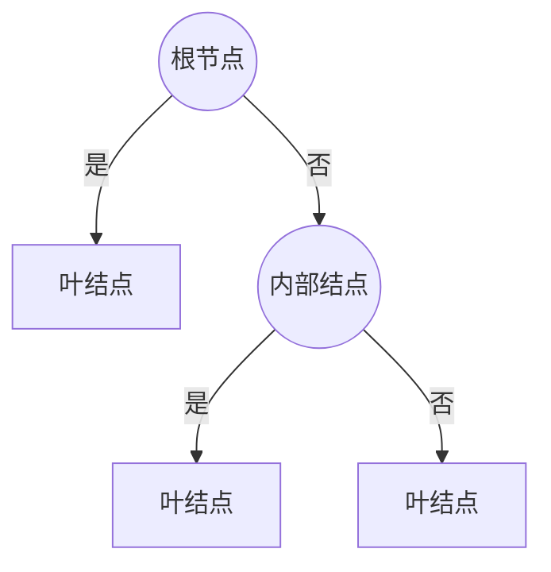

# 决策树 Decision Tree

决策树是一种基本的分类与回归方法，这里主要讨论分类问题。**他可以认为是if-then规则的集合，也可以认为是定义在特征空间与类空间上的条件概率分布。**学习过程主要包括3个步骤：特征选择、决策树的生成、决策树的修建，并根据损失函数最小化的原则建立决策树模型。


## 1. Model

> 定义 5.1 (决策树) $\quad$ 分类决策树模型是一种描述对实例进行分类的树形结构。决策树由结点 ( node ) 和有向边 ( directed edge ) 组成。结点有两种类型: 内部结点 ( internal node ) 和叶结,点 ( leaf node ) 。内部结点表示一个特征或属性, 叶结点表示一个类。



### 1.1 决策树与if-then规则

- 根结点到叶结点的每一条路径是一条规则
- 路径上的内部节点对应规则的条件
- 叶结点的类对应规则的结论
- if-then规则是**互斥且完备**，即每一个实例有且仅有被一条路径/规则覆盖。

### 1.2 决策树与给定特征条件下的类条件概率分布

**决策树的生成等价于对特征空间的划分(partition)**，从而划分成互不相交的单元(cell)/区域(region)，再每一个单元定义一个类的概率分布就构成的一个条件概率分布。决策树所表示的条件概率分布由各个单元给定条件下类的条件概率分布组成。

$P(Y|X),\;X:特征的随机变量\;\;\;\;Y:类的随机变量$

条件概率$P(Y|X)$往往偏大于某一类$y$。分类时把该节点实例强行分到条件概率大的那一类。


### 1.3 决策树的学习

学习本质：为训练数据集归纳出一组分类规则

- 正确分类训练数据集的决策树可能有很多个，可能没有
- 需要找到一个与训练数据集的误差较小、泛化能力高的决策树

损失函数与策略：最小化正则化后的极大似然函数

算法：递归的选择最优特征。ID3、C4.5、CART

剪枝：树枝多，复杂，泛化能力低。自下而上进行剪枝。树的生成考虑局部最优，树的剪枝考虑全局最优。


## 2. 特征选择 Feature Selection

通过信息增益（比）来选取具有分类能力的特征（指那些与随机分类有较大查别的特征），从而提高决策树的学习效率。

### 2.1 信息增益 Information Gain

#### 2.1.1 熵 Entropy、信息熵

> 定义 5.01（熵）		熵是表示随机变量不确定性的度量。设$X$为离散随机变量，概率分布为
> $$
> P\left(X=x_{i}\right)=p_{i}, \quad i=1,2, \cdots, n
> $$
> 随机变量$X$的熵为
> $$
> H(X)=H(p)=-\sum_{i=1}^{n} p_{i} \log p_{i}
> $$
>
> $$
> 对p_i=0，定义0log0=0\nonumber
> $$

- 在(2)中，对数底为2/$e$时，熵单位为比特bit/纳特nat
- 熵只和$X$的分布有关，与取值$x_i$无关
- 熵越大，随机变量的不确定性就越大
- $0 \leqslant H(p) \leqslant \log n$

#### 2.1.2 条件熵 Conditional Entropy

> 定义 5.02（条件熵）		对随机变量(X,Y)，联合概率分布为
> $$
> P\left(X=x_{i}, Y=y_{j}\right)=p_{i j}, \quad i=1,2, \cdots, n ; \quad j=1,2, \cdots, m\nonumber
> $$
> 条件熵$H(Y|X)$表示一直随机变量$X$的情况下随机变量$Y$的不确定性。**定义为给定$X$后$Y$的条件概率分布的熵对$X$的数学期望**，即
> $$
> H(Y \mid X)=\sum_{i=1}^{n} p_{i} H\left(Y \mid X=x_{i}\right)\\
> p_{i}=P\left(X=x_{i}\right), i=1,2, \cdots, n
> $$

当熵和条件熵的概率有极大似然估计得到时，对应的为经验熵(empirical entropy)和经验条件熵(empirical conditional entropy)

#### 2.1.3 信息增益

**信息增益表示得知特征$X$的信息从而使得类$Y$的信息的不确定性减少程度。**

> 定义 5.2 (信息增益) $\quad$ 特征 $A$ 对训练数据集$D$的信息增益 $g(D, A),$ 定义为集合$D$的经验熵$H(D)$ 与特征 $A$ 给定条件下$D$的经验条件熵 $H(D \mid A)$ 之差，即
> $$
> g(D, A)=H(D)-H(D \mid A)\nonumber
> $$

- 熵和条件熵之差称为互信息 mutual information，在决策树中即为信息增益
- $D$一般为标签

#### 2.1.4 信息增益比 information gain ratio

在训练集里，某一个特征较多时，信息增益会偏大。因此采用信息增益比来校正。

> 定义 5.3 $ (信息增益比) $$\quad$ 特征 $A$ 对训练数据集 $D$ 的信息增益比 $g_{R}(D, A)$ 定义为其信息增益 $g(D, A)$ 与训练数据集 $D$ 关于特征 $A$ 的值的熵 $H_{A}(D)$ 之比，即
> $$
> g_{R}(D, A)=\frac{g(D, A)}{H_{A}(D)}
> $$
> 其中 $, H_{A}(D)=-\sum_{i=1}^{n} \frac{\left|D_{i}\right|}{|D|} \log _{2} \frac{\left|D_{i}\right|}{|D|}, n$ 是特征 $A$ 取值的个数。

#### 2.1.5 特征增益的算法

对数据集$D$，有$k$个类$C_k$，对特征$A$有$n$个取值$D_n$，$D_{i k}=D_{i} \cap C_{k}$，$|D|$为数据集中的样本个数

> 算法 5.1 (信息增益的算法)
> 输入: 训练数据集 $D$ 和特征 $A$;
> 输出: 特征 $A$ 对训练数据集 $D$ 的信息增益 $g(D, A)$ 。
> (1) 计算数据集 $D$ 的经验熵$H(D)$
> $$
> H(D)=-\sum_{k=1}^{K} \frac{\left|C_{k}\right|}{|D|} \log _{2} \frac{\left|C_{k}\right|}{|D|}\nonumber
> $$
> (2) 计算特征 $A$ 对数据集 $D$ 的经验条件熵 $H(D \mid A)$
> $$
> H(D \mid A)=\sum_{i=1}^{n} \frac{\left|D_{i}\right|}{|D|} H\left(D_{i}\right)=-\sum_{i=1}^{n} \frac{\left|D_{i}\right|}{|D|} \sum_{k=1}^{K} \frac{\left|D_{i k}\right|}{\left|D_{i}\right|} \log _{2} \frac{\left|D_{i k}\right|}{\left|D_{i}\right|}\nonumber
> $$
> (3) 计算信息增益
> $$
> g(D, A)=H(D)-H(D \mid A)\nonumber
> $$

- 没有特征B！A是特征的符号


## 3. ID3 Algorithm

决策树各个节点熵应用信息增益准则选择特征，递归构建决策树。

从根结点开始，计算所有可能的特征，选取信息增益最大的特征作为节点特征。并由该特征的不同取值点建立子节点。递归调用。

> 算法 5.2 (ID3 算法)
> 输入: 训练数据集 $D,$ 特征集 $A$ 间值 $\varepsilon ;$$\\$
>
> 输出：决策树 $T$ 。
>
> (1) 若 $D$ 中所有实例属于同一类 $C_{k},$ 则 $T$ 为单结点树，并将类 $C_{k}$ 作为该结点 的类标记，返回 $T$;
> (2) 若 $A=\varnothing,$ 则 $T$ 为单结点树，并将 $D$ 中实例数最大的类 $C_{k}$ 作为该结点的类标记，返回 $T$ :
> (3) 否则，按算法 5.1 计算 $A$ 中各特征对 $D$ 的信息增益，选择信息增益最大的特征 $A_{g}$ :
>
> (4) 如果 $A_{g}$ 的信息增益小于间值 $\varepsilon,$ 则置 $T$ 为单结点树，并将 $D$ 中实例数最大 的类 $C_{k}$ 作为该结点的类标记，返回 $T$ :
> (5) 否则，对 $A_{g}$ 的每一可能值 $a_{i},$ 依 $A_{g}=a_{i}$ 将 $D$ 分割为若干非空子集 $D_{i},$ 将 $D_{i}$ 中实例数最大的类作为标记，构建子结点，由结点及其子结点构成树 $T,$ 返回 $T$;
> (6) 对第 $i$ 个子结点，以 $D_{i}$ 为训练集，以 $A-\left\{A_{g}\right\}$ 为特征集，逆归地调用步 (1)$\sim$ 步 $(5),$ 得到子树 $T_{i},$ 返回 $T_{i} \circ$

- 极大似然法进行概率估计？
- 只有树的生成，没有剪枝，容易过拟合


## 4. C4.5 Algorithm

ID3算法的改进，用信息增益比来选择特征

> 算法 5.3 (C4.5 的生成算法)
>
> 输入: 训练数据集 $D$, 特征集 $A$ 间值 $\varepsilon$; 
>
> 输出：决策树 $T$ 。
> (1) 如果 $D$ 中所有实例属于同一类 $C_{k},$ 则置 $T$ 为单结点树，并将 $C_{k}$ 作为该结 点的类, 返回 $T$;
> (2) 如果 $A=\varnothing,$ 则置 $T$ 为单结点树，并将 $D$ 中实例数最大的类 $C_{k}$ 作为该结点 的类, 返回 $T$;
> (3) 否则，按式 (5.10) 计算 $A$ 中各特征对 $D$ 的***信息增益比***, 选择信息增益比最大 的特征 $A_{g}$;
> (4) 如果 $A_{g}$ 的信息增益比小于间值 $\varepsilon,$ 则置 $T$ 为单结点树，并将 $D$ 中实例数最 大的类 $C_{k}$ 作为该结点的类, 返回 $T$;
> (5) 否则, 对 $A_{g}$ 的每一可能值 $a_{i},$ 依 $A_{g}=a_{i}$ 将 $D$ 分割为子集若干非空 $D_{i},$ 将 $D_{i}$ 中实例数最大的类作为标记，构建子结点, 由结点及其子结点构成树 $T,$ 返回 $T$;
> (6) 对结点 $i$, 以 $D_{i}$ 为训练集，以 $A-\left\{A_{g}\right\}$ 为特征集，递归地调用步 (1) 步 $(5),$ 得到子树 $T_{i},$ 返回 $T_{i}$ 。


## 5. Pruning

考虑树的复杂度，对生成的决策树进行剪枝，减掉子树或叶结点

**策略：极小化决策树的损失函数**，即正则化的极大似然估计

设树$T$，叶节点个数$|T|$，树$T$的叶结点$t$，此叶结点的样本点个数$N_t$；此叶结点有$K$类样本点的个数$N_{tk}；\;k=1,2,...,K$；此叶结点的经验熵$H_t(T)$，函数参数$\alpha \geq0$。此决策树的损失函数定义为
$$
C_{\alpha}(T)=\sum_{t=1}^{|T|} N_{t} H_{t}(T)+\alpha|T|
$$
经验熵$H_t(T)$为
$$
H_{t}(T)=-\sum_{k} \frac{N_{t k}}{N_{t}} \log \frac{N_{t k}}{N_{t}}
$$
记(6)的左边为$C(T)$
$$
C(T)=\sum_{t=1}^{|T|} N_{t} H_{t}(T)=-\sum_{t=1}^{|T|} \sum_{k=1}^{K} N_{t k} \log \frac{N_{t k}}{N_{t}}
$$
最后得到
$$
C_{\alpha}(T)=C(T)+\alpha|T|
$$

- $C(T)$为样本点个数与经验熵的积，表示模型对训练数据的预测误差
- $|T|$为模型复杂度
  - 越大说明叶结点越多，树越复杂
  - $\alpha$越大，选择较简单的模型树

### 5.1 Pruning algorithm

> 算法 5.4 (树的剪枝算法)
> 输入: 生成算法产生的整个树 $T$, 参数 $\alpha$;
> 输出：修剪后的子树 $T_{\alpha} \circ$
> （1）计算每个结点的经验熵。
> （2）递归地从树的叶结点向上回缩。
>
> 
>
> ​	设一组叶结点回缩到其父结点之前与之后的整体树分别为 $T_{B}$ 与 $T_{A}$, 其对应的 损失函数值分别是 $C_{\alpha}\left(T_{B}\right)$ 与 $C_{\alpha}\left(T_{A}\right),$ 如果
> $$
> C_{\alpha}\left(T_{A}\right) \leqslant C_{\alpha}\left(T_{B}\right)
> $$
> 则进行剪枝，即将父结点变为新的叶结点。
> (3) 返回 ( 2 )，直至不能继续为止，得到损失函数最小的子树 $T_{\alpha^{\circ}}$

- 动态规划的算法实现


## 6. CART Algorithm

分类与回归树(classification and regression tree)是给定随机变量$X$的条件下给出随机变量$Y$的条件概率分布的学习方法。决策树是二叉树，左分支是“是”分支，右否。**通过递归的二分每个特征，使得特征空间划分成有限个单元**，在这些单元上确定概率分布。

### 6.1 CART的生成

#### 6.1.1 回归树生成

##### 6.1.1.1  Model

用**平方误差最小化准则**，进行特征选择，递归的构建二叉决策树。

对数据集$D=\left\{\left(x_{1}, y_{1}\right),\left(x_{2}, y_{2}\right), \cdots,\left(x_{N}, y_{N}\right)\right\}$，$Y$是连续变量，生成回归树。

回归树对应的是**特征空间的划分**以及**划分单元上的输出值**。

> 定义 5.03 （回归树模型）
>
> 假设已将输入空间划分为 $M$ 个单元 $R_{1}, R_{2}, \cdots, R_{M},$ 并且在每个单元 $R_{m}$ 上 有一个固定的输出值 $c_{m},$ 于是回归树模型可表示为
> $$
> f(x)=\sum_{m=1}^{M} c_{m} I\left(x \in R_{m}\right)
> $$

- $x$是特征向量

- 当输入空间划分确定，利用平方误差最小准则可以确定$c_m$的最优值

  - 平方误差定义为$\sum_{x_{i} \in R_{m}}\left(y_{i}-f\left(x_{i}\right)\right)^{2}$。注意$x_i\in R_m$

  - 利用平方误差最小原则，单元 $R_{m}$ 上的 $c_{m}$ 的最优值 $\hat{c}_{m}$ 是 $R_{m}$ 上的所有输入实例 $x_{i}$ 对应的输出 $y_{i}$ 的均值，即
    $$
    \hat{c}_{m}=\operatorname{ave}\left(y_{i} \mid x_{i} \in R_{m}\right)\nonumber
    $$

**问题1：如何划分特征空间，即选择划分点**

通过启发式算法，选择第 $j$ 个变量 $x^{(j)}$和它取的特征值 $s$, 作为切分变量（splitting variable）和切分点 (splitting point)，并定义两个区域
$$
R_{1}(j, s)=\left\{x \mid x^{(j)} \leqslant s\right\} \quad \text { 和 } \quad R_{2}(j, s)=\left\{x \mid x^{(j)}>s\right\}
$$
在一开始的选择基础上，寻找最优切分变量$j$和最优切分点$s$。具体的，求解
$$
\min _{j, s}\left[\min _{c_{1}} \sum_{x_{i} \in R_{1}(j, s)}\left(y_{i}-c_{1}\right)^{2}+\min _{c_{2}} \sum_{x_{i} \in R_{2}(j, s)}\left(y_{i}-c_{2}\right)^{2}\right]
$$

- (11)中，$x^{(j)}$是第$j$个特征，$s$是此特征维度上的值。$x_n$是第$n$个输入向量。[ref](https://blog.csdn.net/u012328159/article/details/93667566)
- (12)中，括号里的对于$c_1,c_2$取极小值是已知的。
- 划分特征空间时是把高维矩形划分为2个子高维矩形。

**问题2：如何确定好输出值$c_m$**

特征空间切分好后，根据最小化平方误差准则，得到相应的最优输出值
$$
\hat{c}_{1}=\operatorname{ave}\left(y_{i} \mid x_{i} \in R_{1}(j, s)\right) \quad \text { 和 } \quad \hat{c}_{2}=\operatorname{ave}\left(y_{i} \mid x_{i} \in R_{2}(j, s)\right)
$$
**总结：**一开始，我们遍历所有输入特征，找到最优的切分特征变量$j$，构成一对$(j,s)$，根据这个构成的超平面，讲特征空间划分成2个区域。对每个子区域重复过程，直到满足停止条件。这种回归树称为最小二乘回归树(least squares regression tree)

##### 6.1.1.2 Algorithm

> 算法 5.5 (最小二乘回归树生成算法)
> 输入: 训练数据集 $D$;
> 输出：回归树 $f(x)$ 。
> 在训练数据集所在的输入空间中，递归地将每个区域划分为两个子区域并决定每个子区域上的输出值，构建二叉决策树:
> （1）选择最优切分变量 $j$ 与切分点 $s$, 求解
> $$
> \min _{j, s}\left[\min _{c_{1}} \sum_{x_{i} \in R_{1}(j, s)}\left(y_{i}-c_{1}\right)^{2}+\min _{c_{2}} \sum_{x_{i} \in R_{2}(j, s)}\left(y_{i}-c_{2}\right)^{2}\right]
> $$
> 遍历变量 $j$, 对固定的切分变量 $j$ 扫描切分点 $s$, 选择使式 (14) 达到最小值的对$(j, s)$
> （2）用选定的对 $(j, s)$ 划分区域并决定相应的输出值:
> $$
> \begin{array}{c}
> R_{1}(j, s)=\left\{x \mid x^{(j)} \leqslant s\right\}, \quad R_{2}(j, s)=\left\{x \mid x^{(j)}>s\right\} \\
> \hat{c}_{m}=\frac{1}{N_{m}} \sum_{x_{i} \in R_{m}(j, s)} y_{i}, \quad x \in R_{m}, \quad m=1,2
> \end{array}
> $$
> （3）继续对两个子区域调用步骤 $(1),(2),$ 直至满足停止条件。
> （4）将输入空间划分为 $M$ 个区域 $R_{1}, R_{2}, \cdots, R_{M},$ 生成决策树:
> $$
> f(x)=\sum_{m=1}^{M} \hat{c}_{m} I\left(x \in R_{m}\right)
> $$

##### 6.1.1.3 Example

|       | $x^1$ | $x^2$ | $x^3$ | $y$  |
| :---: | :---: | :---: | :---: | :--: |
| $x_1$ |  1.2  |   3   |  2.5  |  1   |
| $x_2$ |  1.5  |   4   |  3.5  |  1   |
| $x_3$ | 1.6.  |   6   | 2.75  |  2   |
| $x_4$ |  1.8  |   9   | 2.25  |  3   |

**Q：**对以上数据集基于最小化平方误差生成二叉回归树

1. 设$j=x^1$，$s=1.5$时

   $c_1=1,\;c_2=2.5$

   $\min _{c_{1}} \sum_{x_{i} \in R_{1}(j, s)}\left(y_{i}-c_{1}\right)^{2}+\min _{c_{2}} \sum_{x_{i} \in R_{2}(j, s)}\left(y_{i}-c_{2}\right)^{2}=\\ [(1-1)^2+(1-1)^2]+[(2-2.5)^2+(3-2.5)^2]=0.5$

   $(j,s)=(x^1,1.6),\;0.67$

   $(j,s)=(x^1,1.2),\;(j,s)=(x^1,1.8)$的结果一定偏大

   对固定$j=x^1$，$s=1.5$是最佳切分点，$error=0.5$

2. 设$j=x^2$

   最佳切分为$(j,s)=(x^2,4),\;error=0.5$

3. 设$j=x^3$

   最佳切分为$(j,s)=(x^3,2.75),\;error=2$

4. $\min _{j, s}=\min[0.5,\;0.5,\;2]=0.5$，选择$(j,s)=(x^1,1.5)$作为最优划分。划分后的子集$R_1,\;R_2$为

   | **$R_1$左分支** | $x^1$ | $x^2$ | $x^3$ | $y$  |
   | :-------------: | :---: | :---: | :---: | :--: |
   |      $x_1$      |  1.2  |   3   |  2.5  |  1   |
   |      $x_2$      |  1.5  |   4   |  3.5  |  1   |
   | **$R_2$右分支** | $x^1$ | $x^2$ | $x^3$ | $y$  |
   |      $x_3$      | 1.6.  |   6   | 2.75  |  2   |
   |      $x_4$      |  1.8  |   9   | 2.25  |  3   |

   $\hat{c}_1=1,\;\hat{c}_2=2.5$

5. 对左右分支继续迭代1-4的步骤，直到满足停止条件

#### 6.1.2 分类树的生成

分类树用基尼指数选择最优特征，同时决定该特征的最优二值切分点。

##### 6.1.2.1 Gini Index

> 定义 5.4 (基尼指数) $\quad$ 分类问题中，假设有 $K$ 个类，样本点属于第 $k$ 类的概率
> 为 $p_{k}$, 则棍率分布的基尼指数定义为
> $$
> \operatorname{Gini}(p)=\sum_{k=1}^{K} p_{k}\left(1-p_{k}\right)=1-\sum_{k=1}^{K} p_{k}^{2}
> $$
> 对于二类分类问题, 若样本点属于第 1 个类的概率是 $p,$ 则概率分布的基尼指数为
> $$
> \operatorname{Gini}(p)=2 p(1-p)
> $$
> 对于给定的样本集合 $D,$ 其基尼指数为
> $$
> \operatorname{Gini}(D)=1-\sum_{k=1}^{K}\left(\frac{\left|C_{k}\right|}{|D|}\right)^{2}
> $$
> 这里, $C_{k}$ 是 $D$ 中属于第 $k$ 类的样本子集， $K$ 是类的个数。
>
> 如果样本集合 $D$ 根据**特征 $A$** 是否取某一可能值 $a$ 被分割成 $D_{1}$ 和 $D_{2}$ 两部分，即
> $$
> D_{1}=\{(x, y) \in D \mid A(x)=a\}, \quad D_{2}=D-D_{1}\nonumber
> $$
> 则在特征 $A$ 的条件下，集合 $D$ 的基尼指数定义为
> $$
> \operatorname{Gini}(D, A)=\frac{\left|D_{1}\right|}{|D|} \operatorname{Gini}\left(D_{1}\right)+\frac{\left|D_{2}\right|}{|D|} \operatorname{Gini}\left(D_{2}\right)
> $$

- 基尼指数表示集合的不确定性。基尼指数越大，集合的不确定性越大。和熵相似。
- 二元分类中基尼指数、单位比特熵和分类误差的关系。x轴：概率p。y轴：损失。

##### 6.1.2.2 Algorithm

> 算法 5.6 (CART 生成算法)
>
> 输入: 训练数据集 $D,$ 停止计算的条件;
> 输出: CART 决策树。 
>
> 根据训练数据集，从根结点开始，递归地对每个结点进行以下操作，构建二叉决策树:
> （1） 设结点的训练数据集为 $D$, 计算现有特征对该数据集的基尼指数。此时，对每一个特征 $A,$ 对其可能取的每个值 $a,$ 根据样本点对 $A=a$ 的测试为“是”或“否”，将$D$ 分割成 $D_{1}$ 和 $D_{2}$ 两部分，利用式 (20) 计算 $A=a$ 时的基尼指数。
> （2）在所有可能的特征 $A$ 以及它们所有可能的切分点 $a$ 中，选择基尼指数最小的
> 持征及其对应的切分点作为最优特征与最优切分点。依最优特征与最优切分点，从现
> 结点生成两个子结点，将训练数据集依特征分配到两个子结点中去。
> （3）对两个子结点递归地调用 ( 1 )， (2) , 直至满足停止条件。
> （4）生成 CART 决策树。

### 6.2 CART的剪枝

**步骤：**

1. 对生成算法产生的决策树$T_0$底端开始不断剪枝，直到$T_0$的根结点，形成子树序列$\left\{T_{0}, T_{1}, \cdots, T_{n}\right\}$
2. 通过交叉验证法，在独立的验证数据集上对字数序列进行测试，选择最优子书。

#### 6.2.1 剪枝成一个子树序列

子树的损失函数为
$$
C_{\alpha}(T)=C(T)+\alpha|T|\nonumber
$$

- $C(T)=\sum_{t=1}^{|T|} N_{t}\left(1-\sum_{k=1}^{K}\left(\frac{N_{t k}}{N_{t}}\right)^{2}\right),|T|$ 是叶结点个数，$K$ 是类别个数
- 定义推导同(5)-(8)

- 对固定$\alpha$，**唯一存在**最优子树$T_{\alpha}$，使得损失函数$C_{\alpha}(T)$最小。
  - 此处“最优”的意义是指使得损失函数最小
  - $\alpha$越大，最优子树$T_{\alpha}$越小。当 $\alpha \rightarrow \infty$ 时，叶结点不断被剪，根结点组成的单结点树是最优的。

对一个整体树$T_0$，它的子树是**有限个**的。因此，对一个连续参数$\alpha$，我们得到了最优子树$T'(\alpha)$。$\alpha$不断增大，在增大到**跳跃点$\alpha'$**之前，$T'(\alpha)$依然是最优子树。即$T'(\alpha)=T'(\alpha+\Delta\alpha)$。再跳跃点之后，易知最优子树$T'(\alpha’)\in T'(\alpha)$。

上面可以表述为：将 $\alpha$ 从小增大, $0=\alpha_{0}<$$\alpha_{1}<\cdots<\alpha_{n}<+\infty,$ 产生一系列的区间 $\left[\alpha_{i}, \alpha_{i+1}\right), i=0,1, \cdots, n ;$ 剪枝得到的子树序列对应着区间 $\alpha \in\left[\alpha_{i}, \alpha_{i+1}\right), i=0,1, \cdots, n$ 的最优子树序列 $\left\{T_{0}, T_{1}, \cdots, T_{n}\right\},$ **序列中的子树是嵌套的**。

具体来说，从整体树$T_0$，$\alpha=0$开始剪枝。对$T_0$内的任意内部结点$t$：

以$t$为单结点树的损失函数为
$$
C_{\alpha}(t)=C(t)+\alpha
$$
以 $t$ 为根结点的子树 $T_{t}$ 的损失函数为
$$
C_{\alpha}\left(T_{t}\right)=C\left(T_{t}\right)+\alpha\left|T_{t}\right|
$$
当 $\alpha=0$ 及 $\alpha$ 充分小时，有不等式
$$
C_{\alpha}\left(T_{t}\right)<C_{\alpha}(t)
$$
当 $\alpha$ 增大时，在某一 $\alpha$ 有
$$
\begin{align}
C_{\alpha}\left(T_{t}\right) &=C_{\alpha}(t)\\
\alpha &=\frac{C(t)-C\left(T_{t}\right)}{\left|T_{t}\right|-1}
\end{align}
$$

**此时$T_t$和$t$有相同的损失函数值，因为$t$的结点更少，所以取$t$，剪去以 $t$ 为根结点的子树 $T_{t}$ **

根据这个性质，我们可以找到系列区间以及对应的最优子树序列

对$T_0$的每一个内部节点$t$，计算
$$
g(t)=\frac{C(t)-C\left(T_{t}\right)}{\left|T_{t}\right|-1}
$$
$g(t)$表示剪枝后整体损失函数减小的程度。在 $T_{0}$ 中剪去 $g(t)$ 最小的 $T_{t},$ 将得到的子树作为 $T_{1},$ 同时将最小的 $g(t)$ 设为 $\alpha_{1}$。$ T_{1}$ 为区间 $\left[\alpha_{1}, \alpha_{2}\right)$ 的最优子树。循环直到得到根结点。

- 在这个过程中，$g(t)=\alpha$是不断增大的？

#### 6.2.2 交叉验证

利用独立的验证数据集，测试子树序列 $\left\{T_{0}, T_{1}, \cdots, T_{n}\right\}$中每个子树的平方误差/基尼指数，选择最优决策树$T_{\alpha}$。

- 子树序列 $\left\{T_{0}, T_{1}, \cdots, T_{n}\right\}$在剪枝的时候是对应$\alpha$的最优子序列

#### 6.2.3 Algorithm

> 算法 5.7 (CART 剪枝算法)
> 输入: CART 算法生成的决策树 $T_{0}$;
> 输出：最优决策树 $T_{\alpha \circ}$
> (1) 设 $k=0, T=T_{0}$ 。
> (2) 设 $\alpha=+\infty$ 。
> (3) 自下而上地对各内部结点 $t$ 计算 $C\left(T_{t}\right),\left|T_{t}\right|$ 以及
> $$
> \begin{aligned}
> 
> g(t) &=\frac{C(t)-C\left(T_{t}\right)}{\left|T_{t}\right|-1} \\
> \alpha &=\min (\alpha, g(t))
> \end{aligned}
> $$
> 这里, $T_{t}$ 表示以 $t$ 为根结点的子树, $C\left(T_{t}\right)$ 是对训练数据的预测误差, $\left|T_{t}\right|$ 是 $T_{t}$的叶结点个数。
> (4) 对 $g(t)=\alpha$ 的内部结点 $t$ 进行剪枝，并对叶结点 $t$ 以多数表决法决定其类，得到树 $T$ 。
> (5) 设 $k=k+1, \alpha_{k}=\alpha, T_{k}=T_{\circ}$
> (6) 如果 $T_{k}$ 不是由根结点及两个叶结点构成的树，则回到步骤 (2)$;$ 否则令 $T_{k}=T_{n}$
> (7) 采用交义验证法在子树序列 $T_{0}, T_{1}, \cdots, T_{n}$ 中选取最优子树 $T_{\alpha^{\circ}}$


## 7. Question

1. 为什么$C(T)$能表示模型对训练数据的预测误差
2. ~~正则化的极大似然估计？~~
3. ~~**1.2**中的'构成一个条件概率分布'，不是叶结点咋办？~~
4. ~~6.1.1 启发式算法？~~
5. CART决策时有没有可能对一个特征二叉再接个二叉，成$2^2$个叉？


## 8. Code

### 8.1 ID3: create, test, visualization

```python
class DecisionTree():
    def __init__(self, model):
        self.model = model

    def CARTClassification(self):
        pass

    def CARTRegression(self):
        pass

    def ID3_create(self, train_set, features, labels, tol=[0.1, 2], visible=False):
        """
        create ID3 tree
        :param train_set: m*n ndarray. m: samples, n: features
        :param features: n size vector
        :param labels: m size ndarray
        :param tol: tolerate for pre-pruning
        :return: ID3 tree in dict type
        """
        '''
        three conditions to stop iteration:
          1. all labelss are the same
          2. no feature
          3. info_gain < tol[0], samples > tol[1]. pre-pruning
          4. same training values but different labels
        '''
        train_set = np.array(train_set)
        labels = np.array(labels)

        if len(np.unique(labels)) == 1:  # condition 1
            return labels[0]

        if train_set.shape[1] == 0:  # condition 2
            return np.sort(labels)[-1]  # return the most frequency value

        # condition 3 & 4
        # not finished


        # get best feature
        best_feature_index, best_info_gain = self.ID3_best_feature(train_set, labels)
        best_feature_name = features[best_feature_index]
        print('best selected feature is ', best_feature_name, ', its information gain is ', best_info_gain)

        ID3Tree = {best_feature_name: {}}  # return feature name as a dict key
        # return unique values under the feature and as the node(key)
        tree_nodes = np.unique(train_set.T[best_feature_index])
        # small feature set for dealing feature set depending on its index
        features = np.delete(features, best_feature_index)
        # iteration in these nodes
        for node in tree_nodes:
            train_sample_index = train_set.T[best_feature_index] == node
            node_labels = labels[train_sample_index]
            # small train set with node feature's column equal node value
            node_train_set = self.spilt_dataset(train_set, best_feature_index, node)
            # small train set without node feature
            node_train_set = np.delete(node_train_set, best_feature_index, axis=1)
            # iteration
            ID3Tree[best_feature_name][node] = self.ID3_create(node_train_set, features, node_labels)

        if visible is True:
            treePlotter.ID3_Tree(ID3Tree)
        return ID3Tree

    @staticmethod
    def entropy(array):
        """
        calculate bit entropy
        :param array: 1-D numpy array
        :return: entropy in bit
        """
        count_array = np.unique(array, return_counts=True)[1]  # unique values and its occurrences
        probability = count_array / array.size  # probability of values
        h_p = np.dot(-probability, np.log2(probability))  # entropy
        return h_p

    @staticmethod
    def conditional_entropy(Y, X):
        """
        get conditional entropy H(Y|X)
        :param Y: random variable, 1-D numpy array
        :param X: given random variable, 1-D numpy array
        :return: conditional entropy of Y given X, H(Y|X)
        """
        Y = np.array(Y)
        X = np.array(X)
        hY_X = 0  # initialization
        X_value, X_count = np.unique(X, return_counts=True)  # unique values and its occurrences
        for xi in X_value:
            index = np.argwhere(X == xi)  # get index of X=xi
            p_xi = index.size / X.size  # P(X=xi)
            Yi = Y[index]  # get yi given xi
            hYi_xi = DecisionTree.entropy(np.array(Yi))  # H(Y|X=xi)
            hY_X += p_xi * hYi_xi
        return hY_X

    @staticmethod
    def info_gain(Y, X):
        """
        get information gain G(Y,X)
        :param Y: random variable, 1-D numpy array
        :param X: given random variable, 1-D numpy array
        :return: information gain of Y given X, G(Y|X)
        """
        return DecisionTree.entropy(Y) - DecisionTree.conditional_entropy(Y, X)

    @staticmethod
    def spilt_dataset(dataset, colume, value):
        """
        dataset with small samples
        :param dataset: m*n ndarray
        :param colume:  axis
        :param value: compared value
        :return: l*n ndarray, l<m
        """
        dataset = pd.DataFrame(dataset)
        df = dataset[dataset[colume] == value]

        return np.array(df)

    @staticmethod
    def ID3_best_feature(train_set, labels):
        """
        return the feature with the highest infomation gain
        :param train_set: m*n ndarray. m: samples, n: features
        :param labels: m size ndarray.
        :return: best feature index and its infomation gain
        """
        features = train_set.shape[1]  # number of features
        tmp = np.ones(features) * -1  # store info gain
        for i in range(features):  # calculate info gain of each features
            feature_list = train_set.T[i]
            gain = DecisionTree.info_gain(labels, feature_list)
            tmp[i] = gain
            print("the info gain of %d th feature in ID3 is: %.3f" % (i, gain))
        best_feature = np.argmax(tmp)
        best_info_gain = tmp[best_feature]
        return best_feature, best_info_gain

    @staticmethod
    def classify(tree, sample, features):
        """

        :param tree: dict
        :param sample: 1-d ndarray
        :param features: 1-d ndarray
        :return:
        """
        first_str = list(tree.keys())[0] # root name
        small_tree = tree[first_str] #
        feature_index = features.index(first_str)
        label = 'None'
        for key in small_tree.keys():
            if str(sample[feature_index]) == key:
                if type(small_tree[key]).__name__ == 'dict':
                    label = DecisionTree.classify(small_tree[key], sample, features)
                else:
                    label = small_tree[key]
        return label
```

- [More details and examples](https://github.com/ChongfengLing/Statistical-Learning-Method-Notes-Code)


## 9. Reference

[分类与回归树（classification and regression tree，CART）之回归](https://blog.csdn.net/u012328159/article/details/93667566)

[回归树](https://zhuanlan.zhihu.com/p/101721467)

[分类与回归树（classification and regression tree，CART）之回归](https://blog.csdn.net/u012328159/article/details/93667566)

[Erikfather/Decision_tree-python](https://github.com/Erikfather/Decision_tree-python)

[统计学习方法（第2版）](https://book.douban.com/subject/33437381/)